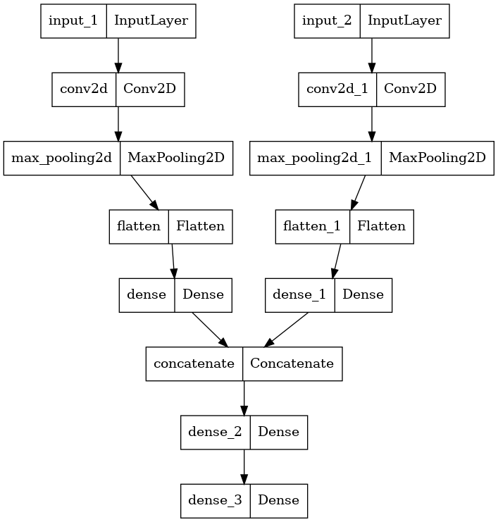

# ml4sci-evaluation-test
A repository containing my submissions for the evaluation test for prospective GSoC applicants for the CMS and End-to-End Deep Learning Project.

I am applying for the project **Vision Transformers for End-to-End Particle Reconstruction for the CMS Experiment**.

**Note**- Use [NBViewer](https://nbviewer.org/) to view the jupyter notebooks, as Jupyter notebook cell outputs are not rendered on GitHub. Or clone the repository to local for viewing Jupyter notebook cell outputs.

## Task 1: Electron/photon classification

**NBViewer Link**: [Task 1 Tensorflow Notebook](https://nbviewer.org/github/abh1-ja1n/ml4sci/blob/main/task1_cnn_tf.ipynb)

**NBViewer Link**: [Task 1 Pytorch Notebook](https://nbviewer.org/github/abh1-ja1n/ml4sci/blob/main/task1_cnn_pytorch.ipynb)

I have used different models for Pytorch and Tensorflow Implementation.

### Tensorflow Model

Feeded `hit energy` and `time` channels to different `Input` layers.

| Train AUC Score     | Validation AUC Score     | Best Validation AUC Score   |
| :-------------------:|:----------------------:| :--------------------------:|
| 0.8008                | 0.6805                 |                      0.7895 |

In [Task 1 Tensorflow](https://nbviewer.org/github/abh1-ja1n/ml4sci/blob/main/task1_cnn_tf.ipynb) implementation, I have used `keras.metrics.AUC` as the evaluation metric.
The validation AUC score and loss is fluctuating (I have tried with different learning rates, optimizers, models and layers' parameters, but the issue remains the same).

### Pytorch Model

Feeded both `hit energy` and `time` channels to `Conv2D` input layer.

| Train AUC Score     | Validation AUC Score     |
| :-------------------:|:----------------------:|
| 0.74               | 0.71             |

In [Task 1 Pytorch](https://nbviewer.org/github/abh1-ja1n/ml4sci/blob/main/task1_cnn_pytorch.ipynb) implementation, I have used `sklearn.metrics.roc_auc_score` as the evaluation metric.

## Task 2: Deep Learning based Quark-Gluon Classification

**NBViewer Link**: [Task 2 Notebook](https://nbviewer.org/github/abh1-ja1n/ml4sci/blob/main/task2.ipynb)

I have used the `run0` file dataset for this task. I have used Tensorflow for model implementation.

### Model

Feeded `X_jets`, `pt`, `m0` to different `Input` layers.

| Train AUC Score     | Validation AUC Score     |
| :-------------------:|:----------------------:|
| 0.785               | 0.771             |

In [Task 2](https://nbviewer.org/github/abh1-ja1n/ml4sci/blob/main/task2.ipynb) implementation, the challenge was that `numpy` was detecting `X_jets` as a numpy object, instead of `ndarray`. `numpy`'s inbuilt functions were taking unbounded time to process `X_jets` into `ndarray` object. So, I used four nested loops to copy the data into `ndarray` object. I have used `5x5` kernel size and pool size for `Conv2D` and `MaxPooling2D`, owing to the sparse data.

## Task 3: Vision Transformers

**NBViewer Link**: [Task 3 Notebook](https://nbviewer.org/github/abh1-ja1n/ml4sci/blob/main/task3.ipynb)

I have used [Vision Transformer](https://keras.io/examples/vision/image_classification_with_vision_transformer/) based Model, with `Dropout` rates as 0. As the data is sparse, we cannot afford `Dropout` layers in the Transformer model. Used `softmax` as activation for last `Dense` layer for `Electron` and `Photon` Binary Classification. Model Implementation is in Tensorflow. 

### Model

| Train AUC Score     | Validation AUC Score     | Test AUC Score   |
| :-------------------:|:----------------------:| :--------------------------:|
| 0.806               | 0.782                 |                      0.777 |

## Resulting Performance for Task 1 and Task 3

In Task 1 implementation using CNN, the validation loss and AUC score was fluctuating for the Tensorflow implementation model. In Task 3 implementation using Vision Transformer, the validation loss decreased in proportion to the training loss upto validation loss of 0.56, corresponding to validation AUC score of 0.78. I have used `categorical_crossentropy` loss function. 

